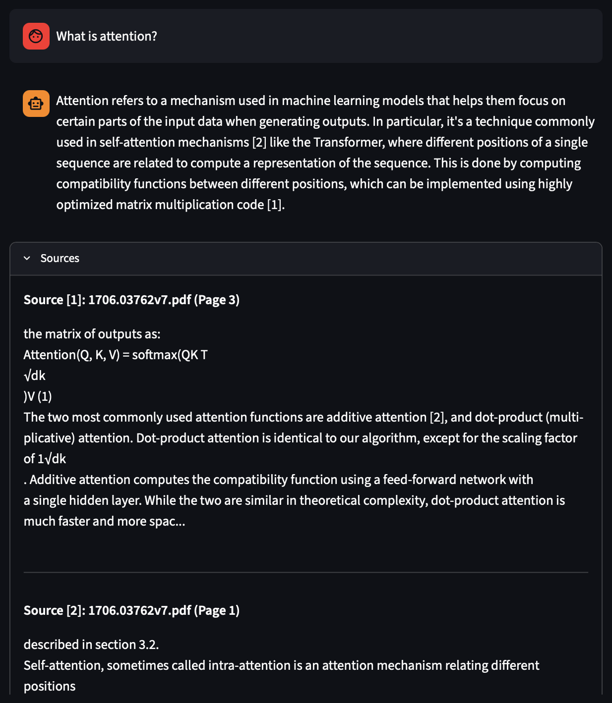
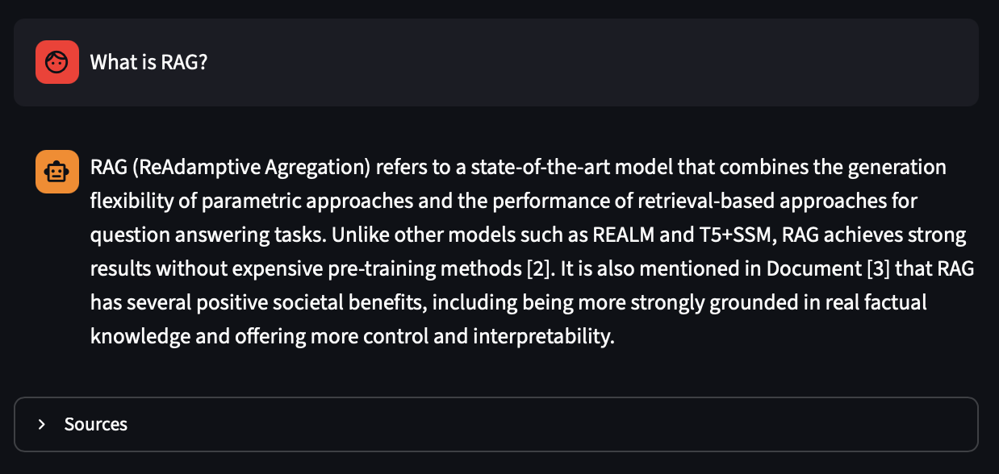

## About

The purpose of this "project" is to practice `langchain` and `RAG` skills by making 
`Articles Helper` — yet another chat-bot who you can give articles (in PDF format) and ask questions about them, 
so ~~you never actually read them~~ you may understand them better.

## How it works

Basically, this chat-bot splits your files in chunks, saves it to local vector store and 
uses most relevant of them when answering (relevance by cosine similarity of embeddings). 
Chat `language is english` and model `remembers the context`. `References are ignored` when searching. 
Also there are `citations feature` — model indicates the sources of answer.

## Installation

Install `ollama`:
```bash
# Linux, macOS
curl -fsSL https://ollama.com/install.sh | sh

# Windows
irm https://ollama.com/install.ps1 | iex
```

Clone project and install dependecies:
```bash
git clone git@github.com:7embl4/rag-llama.git  # ssh
cd rag-lamma

# use whatever you like for env
conda create --name ragllama python=3.10
conda activate ragllama
python -m pip install -r requirements.txt
```

Download models:
```bash
ollama pull llama3.1:8b
ollama pull nomic-embed-text
```

`Note` that you need about 6-7 GB of memory (either RAM or GPU) for `llama3.1:8b`. 

## Usage

1) Make `data` directory (in root) and put there your files (in PDF format)
2) Run in terminal:
    ```bash
    streamlit run app.py
    ```
3) Go to `http://localhost:8501` in browser and use it as chat-bot.

## Examples

Basic view of answering with citations:



Also remember that it's only 8B model, so it can also hallucinate 
(as if you were gonna use it somewhere):


